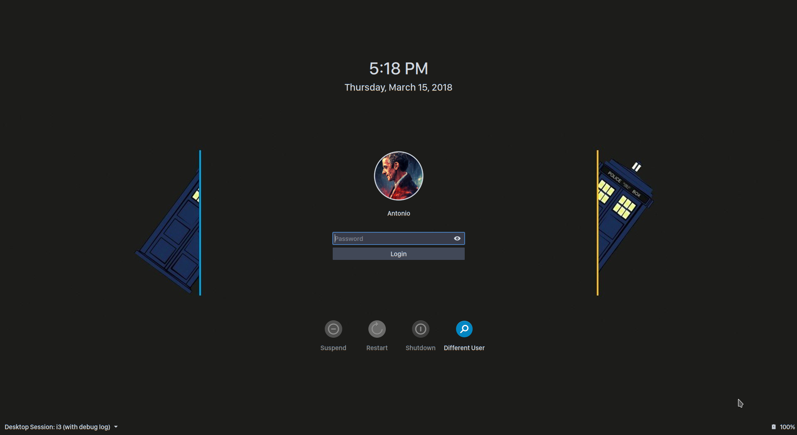

# breeze2

This is a slightly edited version of the default Breeze SDDM theme shipped with KDE Plasma allowing the font to be customized.

### Preview


### Install

```
git clone https://github.com/avivace/breeze2-sddm-theme
sudo mv breeze2-sddm-theme /usr/share/sddm/themes/
```

Set the new theme in `/etc/sddm.conf` or in KDE Settings > Workspace Theme > Startup and Shutdown > Login Screen.

Change the font in `theme.conf`, editing the `displayFont` value.

Beware that SDDM is started by root, so you need to have the selected font available/installed by the root X session. SDDM will also use root X session font rendering configuration.

You can preview the login screen with:

```
sudo sddm-greeter --theme /usr/share/sddm/themes/breeze2/
```

### Why

There's not apparently a decent way to change the font in the default login screen theme in Plasma, a part from changing fallback/system fonts, hence this fork.


[1](https://www.reddit.com/r/kde/comments/56l8rn/is_there_any_way_of_changing_the_sddm_default_font/db0wc5i/), [2](https://unix.stackexchange.com/questions/382793/change-the-font-used-in-the-breeze-sddm-theme), [3](https://github.com/sddm/sddm/issues/718), [4](https://github.com/sddm/sddm/issues/718#issuecomment-297484548), [5](https://ubuntuforums.org/showthread.php?t=2275515)
